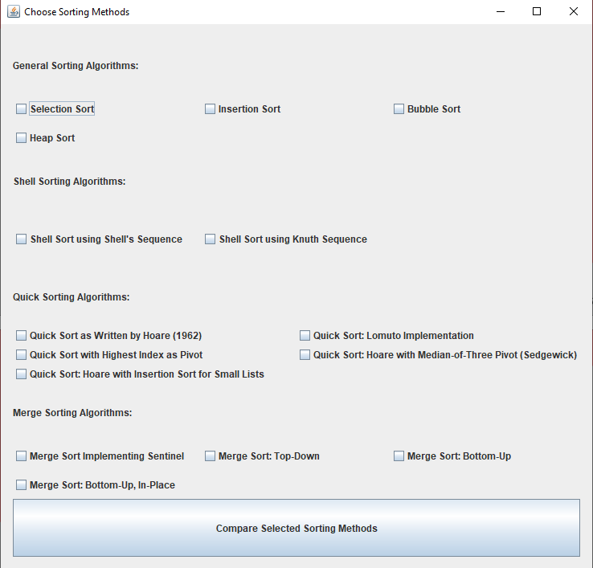

# SortingVisualizer
An application written in Java that performs and visualizes a number of different sorting algorithms.

## About

This is a simple application that was written to help people visualize how different sorting algorithms
work. There are three modes that can be run:
1. Normal mode will perform a sort operation on the data shown in the window.
2. Sorting method comparison mode allows you to run up to four different sorting methods simultaneously.
3. Initial condition comparison mode allows you to run the same sorting method on four different data
   initial conditions.

You are encouraged to play around with the program. Please feel free to leave feedback!

The GUI is not pretty, but it is functional. If you wish to have the GUI beautified, please contact me
to let me know you have interest in this application. If you wish to improve the GUI, please feel free!

## Getting Started

The easiest way to get started is to download `personalSortProject.jar` and just run the executable.
This requires you to have Java installed on your system.

### Visualizing a Sorting Algorithm

### Comparing Initial Conditions

### Choosing Sorting Methods to Compare

### Comparing Sorting Methods

## How it's built

For those that are interested in how this application was put together, please find the Class diagram below.

## License
This application falls under the [GNU GPL v3](./LICENSE)

## Known bugs
1. Only one merge sort can be run at a time.
